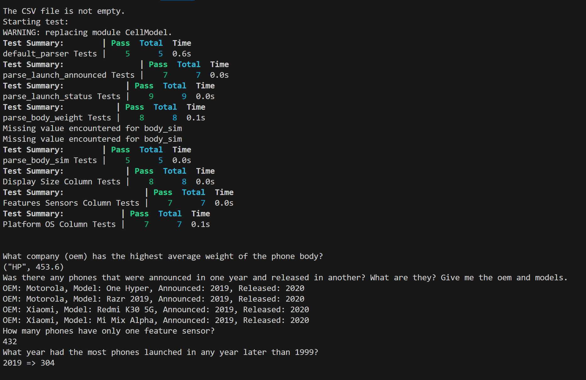

# Project Setup

To set up the project environment, run the following commands in the Julia REPL:

```julia
using Pkg
Pkg.activate(".")
Pkg.instantiate()
#=
Q1: Which programming language and version did you pick?

julia
I picked Julia (v "1.10.2") as my programming language. 


Q2: Why did you pick this programming language?

I picked Julia as my programming language, as I believe it is the perfect language for data science. I find the language extremely intuitive, and in some cases more intuitive than python. Julia is also faster than Python, when python is used without optimization and vector computing using cython and numpy. As I have originally used R for data science during my math degree for its ease of use, I eventually chose Python because R is extremely slow, and will likely use Julia for any solo data science related project, as it has performance gains range from 10x-30x over python. Julia also has GPU support, multiple dispatch, distributed and parallel computing support, and interoperation with other programming languages such as C and Java. 

Throughout the project I found Julia syntax easier to use than Python, especially when defining sets for variables in mutable structures(example : oem::Union{String, Nothing}, here oem variable can be either type string or nothing). However, the only disadvantage that was glaring with Julia is it a victim of its young age. In particular, there are not many packages and libraries available for Julia as there are for Python, and debugging Julia could be slightly difficult given that it is a young language with much less support than Python. 


Q3: How does your programming language chosen handles: object-oriented programming, file ingestion, conditional statements, assignment statements, loops, subprograms (functions/methods), unit testing and exception handling. If one or more of these are not supported by your programming language, indicate it as so. 

OOP:
 Julia doesn't have traditional classes and objects that are present in other langauges such as Java and Python. However, it does have a powerful and flexible type system that effectively supports complex data structuring and behavior encapsulation, similar to OOP. In this project, for example, I've defined a 'mutable struct Cell', which functions similarly to a class. It encapsulates data related to a cell phone, with attributes shown inside of the csv file. 
 
 Julia also supports constructors, which are used here to initialize instances of Cell. For example, the constructor function Cell(row::DataFrameRow) is specifically designed to take a row from a DataFrame, read from the CSV file, then parse and assign it to the fiels of a Cell instance. 

File Injestion:
 Julie can handle file ingestion through built-in functions such as open,read, writen and close. It can also use the CSV package, which is used to read and write to CSV files efficiently. For more complex data manipulation during the process of injesting data, I used the DataFrames package to store data in a table-like structure. 

Conditional Statements: 
 Julia supports all typical conditional statements such as If-else statements (if, elseif, else, etc), as well as the ternary operator '?:', which is a shorthand for if-else conditions. For example, for the following statement below:
 released_year = isa(cell.launch_status, String) ? nothing : cell.launch_status
 If the value of launch_status is a string, then set it to nothing. Else, set it to cell.launch_status. 


Assignment Statements: 

 Julia has a relatively straightforward approach to handling assignment statements, with some interesting features tailored for data manipulation and computing. Julia handles a basic assignment using the '=' operator. Julia allows multiple assignments in a single statement. For example a,b= 5,10 assigns 5 to a and 10 to b. A somewhat unique feature is how Julia  supports destructuring or unpacking assignments such as the following: [a,b,c]=[10,20,30], implies a=10,b=20,c=30. Julia also supports increment and update assignments in the same way as python. For example x +=1 implies we increment x by 1, and x*=2 implies we multiply x by 2 and assign the result to x. Another unique approach in Julia is found when rebinging constants. For example, in Julia, const does not mean that a variable's value cannot change. It means the variable's type cannot change. This is different from C and Java. This features is intended to help speed performance by allowing the compiler to make assumptions about the types but still provide some flexibility in how the constants can be used.  


Loops: 
In Julia, loops are handled in a similar way as Python. Julia has for and while loops. It is important to note that Julias array uses 1-based indexing (Python uses 0-based indexing). However the difference between Julia and Python is performance. Julia has JIT compilation which implies that loop execution is significantly faster compared to python, especially when handling large data sets or large numerical computations. Julia compiles loop constructs to efficient machine code in a manner similar to the C language. One important difference between Julia and Python is how it handles looping through array operations. In Python, we use libraries like NumPy to optimize via vectorization. However, Julia automatically optimizes many looping constructs to be as fast as most vectorized code due to its compiler. 


Subprograms:

 In terms of how Julia handles functions, Julia let's you specify the types of the parameters explicitly when defining functions. For example in our project we have the following parse function: 
 
  function parse_platform_os(os_str::Union  {String, Missing, Nothing})  
  end

 Here, Union{String, Missing, Nothing}) implies that the function can handle inputs that are either a String, Missing (missing data), or Nothing (analogous to null in Python).

 Julia also has the ability of multiple dispatch, where we define multiple methods for the same function based on different argument types. 

Q4: List out 3 libraries you used from your programming language (if applicable) and explain what they are, why you chose them and what you used them for.

I used four libraries: 'CSV', 'DataFrames', and 'Statistics'. I used CSV to handle and read the CSV file 'cells.csv'. I used DataFrames to manipulate the CSV data into a data frame. In particular, CSV.read(filepath, DataFrame) was used to load the csv file cells.csv into a DataFrame. I used 'Statistics' to calculate the mean for the function 'highest_average_weight'. 

Q5: Answer the following questions (and provide a corresponding screen showing output answering them):

=#


#=
What company (oem) has the highest average weight of the phone body?
("HP", 453.6)


Was there any phones that were announced in one year and released in another? What are they? Give me the oem and models.

OEM: Motorola, Model: One Hyper, Announced: 2019, Released: 2020
OEM: Motorola, Model: Razr 2019, Announced: 2019, Released: 2020
OEM: Xiaomi, Model: Redmi K30 5G, Announced: 2019, Released: 2020
OEM: Xiaomi, Model: Mi Mix Alpha, Announced: 2019, Released: 2020

How many phones have only one feature sensor?

432

What year had the most phones launched in any year later than 1999? 

2019 => 304

=#


#Data Injgestion and Cleaning
#== 
For part 1, we will replace each missing/empty, or '-' values with 'nothing'. In Julia, many functions and operations are designed to handle 'nothing' quite well, and it is used to represent null values. 

Checklist (before running actual test):
OEM column: works as intended (nothing is invalid here)
Model column: works as intended (nothing is invalid here)
launch_announced: works as intended (any string of year xxxx replaces the entire string)
launch_status: works as intended
body_dimensions: works as intended, just check for missing or values containing '-', output everything else. 

